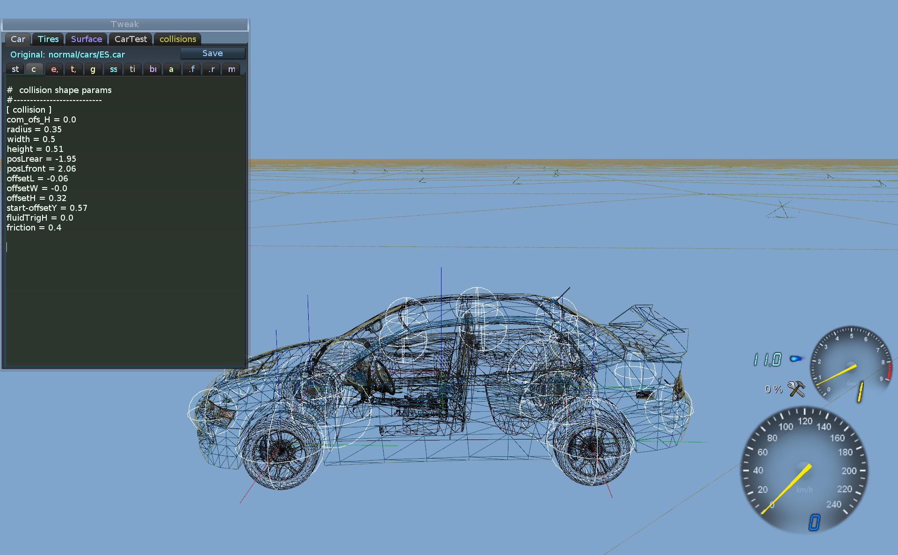
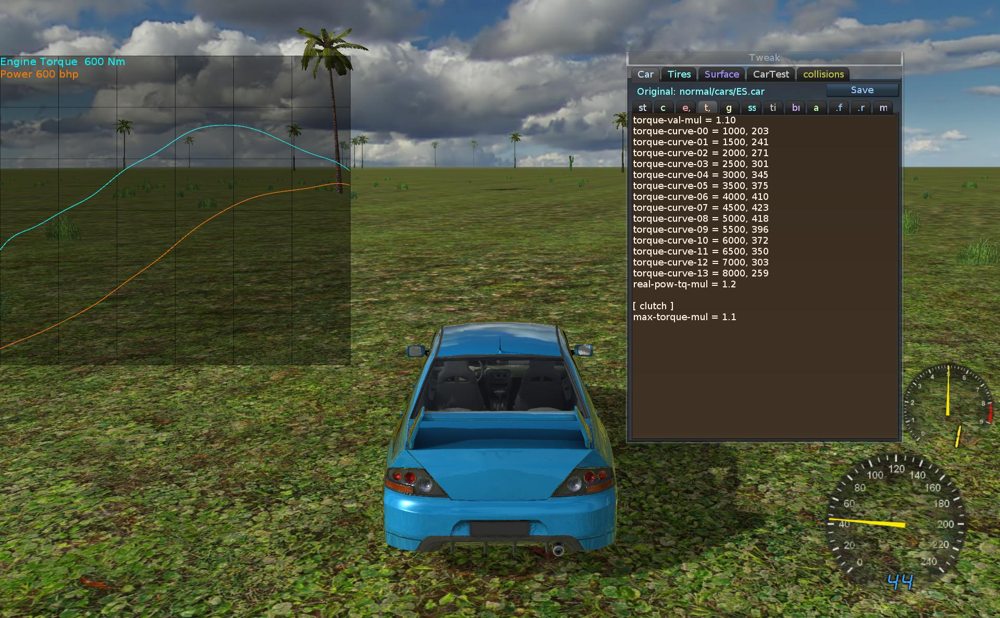
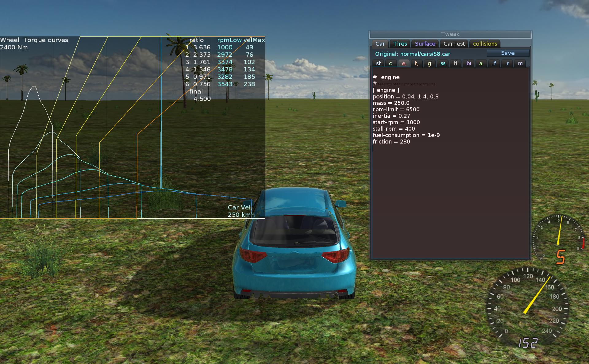
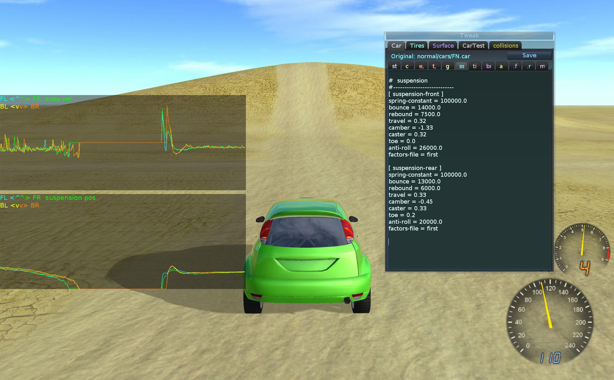
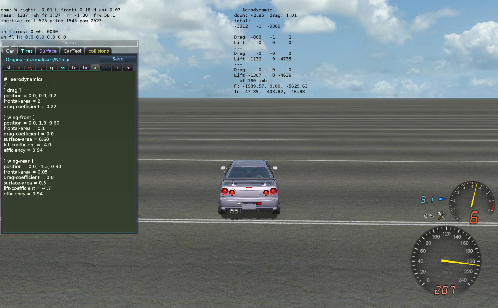

*Car edititng and .car parameters explained.*

  

## Introduction

This Wiki describes the .car file format (car settings), car parameters
inside of it and what editing them does.

You can either use this when tweaking existing cars or *if you modeled a car,  
use it to put car in game properly with physics (or you can also leave
this part for CryHam, he knows it best :-) ).*

  

## Editing .car file

This part explains .car file sections, adjusting those car parameters
and fitting model.

Stunt Rally .car file is based on VDrift .car file from older version
(April 2010).  
But the structure somewhat changed and there are few new parameters.  
*For reference base, you can read [VDrift
wiki](http://wiki.vdrift.net/index.php?title=Car_parameters_for_vdrift-2009-06-15_and_older).
But this Wiki is better, should be sufficient.*

  

### Location

Since we have simulation modes (currently 2: easy and normal) there are
2 .car files (1 for each mode).

data/carsim/easy/cars/3S/3S.car  
data/carsim/normal/cars/3S/3S.car

Those are the original files locations. If you modified it with editor,
then it is saved in user data dir, rest of path is the same.

  

### Sections

Since SR ver 2.1 there are now sections (tabs) in car editor (use F2,F3
to change current).

They appear in same order as written in .car files. But will be
explained in importance order.

| Symbol | Meaning         |
|--------|-----------------|
| st     | steering, model |
| c      | collision       |
| e,     | engine          |
| t,     | torque          |
| g      | gearbox         |
| ss     | suspension      |
| ti     | tires           |
| br     | brakes          |
| a      | aerodynamics    |
| .f     | front wheels    |
| .r     | rear wheels     |
| m      | mass            |

  

### Wheels postion

#### Sections .f and .r - wheels

First thing you'll probably want to do with a new car model, is to put
wheels in good position.

-   *position* has x,y,z values. \*As with all postions in .car, they
    have x,y,z dir going + to: right, front, up\*

<!-- -->

-   *roll-height* determines at which point will tire forces be applied
    to car body.

If set to 1.0, car will never flip over. If set too low, e.g. 0.5 car
will notoriously flip over when steering at speed.

*Setting wheel mass higher will make reaction of wheel (if it hit
something) more perceptible in car body (provided the suspension is
springy not too damped). Using real life values is recommended.*

Also suspension mount position and hinge is set here. If moving whell
position, they need to be adjusted also.

Those aren't yet visualised so need to know (or check with too high
values) if you move them where you want.

For example if you wanted to move front wheels further, you'd need to
change all 1.28 occurences here to something bigger eg. 1.35.

*TODO: show spheres in game for those points ..*

*restitution - no idea if it works..*

    # wheels front (position and suspension mount)
    #---------------------------
    [ wheel-FR ]
    position = 0.74, 1.28, -0.46
    roll-height = 0.9
    mass = 30.0
    restitution = 0.1

    [ suspension-FR ]
    position = 0.58, 1.28, -0.11
    hinge = -0.71, 0.55, -0.0

    [ wheel-FL ]
    position = -0.74, 1.28, -0.46
    roll-height = 0.9
    mass = 30.0
    restitution = 0.1

    [ suspension-FL ]
    position = -0.58, 1.28, -0.11
    hinge = 0.71, 0.55, 0.0

    # wheels rear (position and suspension mount)
    #---------------------------
    [ wheel-RR ]
    position = 0.74, -1.31, -0.46
    roll-height = 0.9
    mass = 30.0
    restitution = 0.1

    [ suspension-RR ]
    position = 0.58, -1.31, -0.11
    hinge = -0.25, -1.94, 0.0

    [ wheel-RL ]
    position = -0.74, -1.31, -0.46
    roll-height = 0.9
    mass = 30.0
    restitution = 0.1

    [ suspension-RL ]
    position = -0.58, -1.31, -0.11
    hinge = 0.25, -1.94, 0.0

  

#### Section ti - tires

Here you can change wheel *radius* (if you have new model for wheels).

-   *rotational-inertia* is how fast the wheel will react to braking
    (stop or start spinning with throttle). Small values are used in
    normal sim mode (about 1), and high in easy sim mode (about 10).

<!-- -->

-   *tread* is not used, and *rolling-resistance* is the same for most
    cars (needs be diffrerent only for bigger wheels and affects top
    speed).

<!-- -->

    #  tires (more in .tire)
    #---------------------------
    [ tire-both ]
    radius = 0.33
    rolling-resistance = 1.3e-2, 6.5e-6
    rotational-inertia = 1.2
    tread = 0.0

Cars can have different front and rear wheels, for example (from TW):

    [ tire-front ]
    radius = 0.46
    ...
    width-trail = 0.4

    [ tire-rear ]
    radius = 0.55
    ...
    width-trail = 0.6

-   *width-trail* is used for bigger wheels to have a broader tire
    trail.

  

### Mass and inertia

#### Section m - mass

Those are the values that determine the car *mass* and inertia (how
quick/slow will it react to rotation).

They are the same for all sim modes, and should be set to close real
values.

Resulting total mass, inertia (3 values) and center of mass position
(com) are shown in car debug text (the top left lines).

*Center of mass determines at which angle the car will flip to roof
naturally (if you flip it to side with key Q).*

Note that other parts like engine, driver, wheels or fuel tank also have
mass and are taken into account.

    # used to calculate the weight distribution and balance
    # (for car total mass and inertia) also use engine mass and position
    #---------------------------
    [ particle-00 ]  # rear
    mass = 250
    position =  0.75, -1.15, 0.08

    [ particle-01 ]
    mass = 250
    position = -0.75, -1.15, 0.08

    [ particle-02 ]  # front
    mass = 250
    position =  0.75,  1.15, 0.08

    [ particle-03 ]
    mass = 250
    position = -0.75,  1.15, 0.08

The 0.75 value is lower and comes from width of car, and 1.15 is from of
car's length.

Last value 0.08 is adjusted for center of mass height (there is also
com_ofs_H in collision for that but it's rather used for sim mode
differences).

Changing e.g. 0.75 to 0.8 will make the car a bit harder to roll,
changing 1.15 to 1.0 will make it much easier to pitch.

Making any or both (x, y) values higher will make the car feel heavier.

  

### Steering and damping

#### Section st - steering

-   *max-angle* is the front wheels steering angle in degrees, wheels
    can steer this angle in both directions.

*Note: this is multiplied by speed sensitive steering (decreases with
higher speed), and factors 1.0 for gravel, 0.7 for asphalt and also by
simulation mode factors (all those can be changed on car setup tab).*

Under rot_drag there are values to damp car rotation depending on rot.
velocity with those coefficients. Check other cars values for reference.
*TODO: check or remove them..*

    drive = AWD
    version = 2
    # all positions have x,y,z dir going + to: right, front, up

    [ steering ]
    max-angle = 26
    angular-damping = 0.0
    flip-pow-mul = 1

    [ rot_drag ]
    roll  = 200.0
    pitch = 400.0
    yaw   = 500.0
    yaw2  = 2.0

All cars have AWD (all wheel drive with 3 differentials). But for
reference, other are possible: front FWD, and rear RWD.

-   *flip-pow-mul* - is used for big cars to scale the flipping torque
    (if auto value was too small).

  

### Flares, Model offsets

#### Section st / flares

Car brake flares (rear red lights turned on when braking) are defined
here.

There can be many points (here are 2) with position set in *brake-pos*
and index number of point.

-   *brake-size* - flare particle size

<!-- -->

-   *brake-color* - r,g,b value for color

<!-- -->

    [ flares ]
    brake-pos0 = 0.58,-2.05, 0.0
    brake-pos1 =-0.58,-2.05, 0.0
    brake-size = 0.46
    brake-color = 1, 0, 0

#### Section st / model

-   *exhaust* params are not used.

<!-- -->

-   *boost-y* (also x or z) are used to fit position when somehow boost
    emiters are in wrong place (because of model axes or dims)

<!-- -->

-   *boost-size-z* - can be used to scale width of both boost emiters

<!-- -->

-   *boost-name* - can be used to have custom particle system name for
    emiters (from .particle file)

<!-- -->

-   *interior-y* (also x or z) - old, to offset interior model position
    (better to do it in blender if possible).

<!-- -->

-   *rot_fix* - on/off, changes model x,y,z axes, use on when exported
    from blender.

<!-- -->

    [ model_ofs ]
    rot_fix = on
    boost-x = -0.22
    boost-z = -0.33
    boost-size-z = 0
    boost-name = BoostRed
    interior-x = 0.05
    interior-y = 0.083
    interior-z = 0
    exhaust-x = 2.4
    exhaust-y = 0.52
    exhaust-z = 0.45
    exhaust-mirror-second = 1

  

### Collision

#### Section c - collision

There is a visualisation for body collision in game (bullet debug, use
it when editing).

Editing collison H params is quite tricky since most of them are
relative to some other values (and may depend on something else).

They are changed so, that the collision matches the car model.

-   *com_ofs_L* - center of mass length offset (front +, rear -), very
    usable parameter, greatly affects car handling. Closer to front
    wheels will allow better steering and easier oversteer. When com is
    closer to rear, car is less steerable, possibly understeering, but
    better to drive straight.

<!-- -->

-   *com_ofs_H* - offset to center of mass height, higher will cause car
    flip over, low will make easier driving and sliding. Too low will
    make collisions feel unreal.

<!-- -->

-   *radius* - is common for all spheres of collision.

<!-- -->

-   *width* and *height* are from car dimensions

<!-- -->

-   *posLrear* and *posLfront* are for length range (e.g. from front
    rear bumpers)

<!-- -->

-   *offsetL,W,H* params are used to offset collsion from model
    (Lenght,Width,Height)

<!-- -->

-   *start-offsetY* - used to offset car location at track start, height
    above ground. Test on Test10-FlatPerf (also use F4) car shouldn't
    jump or fall, just appear on ground.

<!-- -->

-   *fluidTrigH* - to offset fluid triggers height (to match to wheels)
    *TODO: fix, make it auto and with wheel cylinder shapes*

<!-- -->

-   *friction* - rigid body friction for collision

<!-- -->

    #  collision shape params
    #---------------------------
    [ collision ]
    radius = 0.4
    width = 0.49
    height = 0.42
    posLrear = -1.92
    posLfront = 1.92
    offsetL = -0.3
    offsetW = 0.0
    offsetH = 0.23
    start-offsetY = 0.62
    fluidTrigH = 0.0
    friction = 0.4

  

### Engine, torque

#### Section e, - engine

-   *position* and *mass* - used for weight distribution

<!-- -->

-   *rpm-limit* - maximum engine rpm

<!-- -->

-   *start-rpm, stall-rpm* - for lowest rpm

<!-- -->

-   *inertia* - determines how quick the engine reacts to throttle
    pressing (test in Neutral gear), smaller values means quick reaction

<!-- -->

-   *friction* - if throttle isn't pressed (on N gear) this determines
    how fast will the engine rpm fall down, bigger values mean quicker
    fall

<!-- -->

-   *fuel-consumption - isn't really used*

<!-- -->

    #  engine
    #---------------------------
    [ engine ]
    position = 0.0, 1.2, 0.6
    mass = 230.0
    rpm-limit = 6500
    inertia = 0.30
    start-rpm = 1000
    stall-rpm = 400
    fuel-consumption = 1e-9
    friction = 230

#### Section t, - torque curve

Graph used to visualize the curves (engine torque and power from rpm):

-   *torque-val-mul* - is the global multiplier (scales all points
    torque values) and can quickly change car's engine power

<!-- -->

-   *torque-curve-00* = rpm, torque - used to define points of torque
    curve (use graph mode when editing, which draws the curve)

<!-- -->

-   *real-pow-tq-mul* - used to scale car stats values (max engine power
    and max torque), to make them have more sense (closer to real car
    values)

<!-- -->

-   *max-torque-mul* - is the clutch max transmitted torque multiplier,
    usually 1.0 - 1.5 (comes from clutch
    `sliding_friction * max_pressure * area * radius`)

<!-- -->

    torque-val-mul = 0.8
    torque-curve-00 = 1000, 215
    torque-curve-01 = 1500, 265
    torque-curve-02 = 2100, 325
    torque-curve-03 = 2600, 396
    torque-curve-04 = 3000, 456
    torque-curve-05 = 3300, 492
    torque-curve-06 = 3500, 528
    torque-curve-07 = 3800, 560
    torque-curve-08 = 4000, 580
    torque-curve-09 = 4200, 590
    torque-curve-10 = 4400, 594
    torque-curve-11 = 4600, 585
    torque-curve-12 = 4900, 568
    torque-curve-13 = 5500, 508
    torque-curve-14 = 6000, 468
    torque-curve-15 = 6500, 431
    torque-curve-16 = 7000, 370
    real-pow-tq-mul = 1.06

    [ clutch ]
    max-torque-mul = 1.1

  

### Gear ratios

Useful graph for visualising all gear ratios with torque curve from car
speed.

It also shows at which rpm will gears auto shift (rpmLow) and until
which speed will gear work (velMax).

-   *gears* - number of front drive gears

<!-- -->

-   *gear-ratio-X* - are the ratios for all gears (r for reverse,
    1,2,... up to gears)

<!-- -->

-   *shift-delay* - is in seconds the time to change gears. *Half the
    time is spent changing the gear and the other half is spent letting
    the clutch out.*

There are actually 3 differentials when having AWD: front, rear and
center (and just 1 in FWD or RWD).

-   *final-drive* - is the final factor for drive, less will result in
    higher top speed but slower acceleration.

<!-- -->

-   *anti-slip* - is the differential's torque factor and bigger will
    make it slide less.

<!-- -->

    #  gearbox
    #---------------------------
    [ transmission ]
    gears = 6
    gear-ratio-r = -3.23
    gear-ratio-1 = 3.52
    gear-ratio-2 = 2.40
    gear-ratio-3 = 1.77
    gear-ratio-4 = 1.36
    gear-ratio-5 = 1.02
    gear-ratio-6 = 0.76
    shift-delay = 0.12

    [ differential ]
    final-drive = 4.21
    anti-slip = 400.0

    [ fuel-tank ]
    position = -0.1, -0.2, -0.26
    capacity = 100.0
    volume = 100.0
    fuel-density = 0.08

fuel-tank is just used as another mass for weight distribution and has
blocked going empty (no effect).

Differentials can have different settings for front,rear,center

    [ diff-front ]
    anti-slip = 700.0
    torque = 0
    torque-dec = 0

    [ diff-rear ]
    anti-slip = 300.0
    torque = 0
    torque-dec = 0

    [ diff-center ]
    final-drive = 4.50
    anti-slip = 600.0
    torque = 0
    torque-dec = 0

*not used*

torque - anti-slip-torque

torque-dec - anti-slip-torque-deceleration-factor

  

### Suspension

There is a graph visualising current suspension positions for all wheels
and next for suspension move velocities.

-   *spring-constant* - is the wheel rate (in N/m).

<!-- -->

-   *bounce* and *rebound* - are the damping coefficients for
    compression and expansion of the suspension, respectively (in
    N/m/s).

<!-- -->

-   *factors-file* - this is the file that contains points which define
    spring and damper curves (see inside of
    dara/carsim/\[mode\]/first.susp for info)

<!-- -->

-   *travel* - is the range (lenght of suspension) and goes up from
    wheel center. *todo: check this*

*The hinge is the center of the wheel's path as the suspension moves.
The location of the hinge is determined by suspension geometry, and may
be outside of the car itself.*

Wheel alignment is set with the camber, caster, and toe parameters. All
angles are in degrees. *todo: were never changed*

    #  suspension
    #---------------------------
    [ suspension-front ]
    spring-constant = 100000.0
    bounce = 14000.0
    rebound = 7500.0
    travel = 0.32
    camber = -1.33
    caster = 0.32
    toe = 0.0
    anti-roll = 26000.0
    factors-file = first

    [ suspension-rear ]
    spring-constant = 100000.0
    bounce = 13000.0
    rebound = 6000.0
    travel = 0.33
    camber = -0.45
    caster = 0.33
    toe = 0.2
    anti-roll = 20000.0
    factors-file = first

  

### Brakes

-   *friction* - near to 1.0, defines brakes efficency

<!-- -->

-   *max-pressure* - pressure applied, more will make stronger brakes

<!-- -->

-   *bias* - front to rear ratio, note sum of front bias and rear should
    be 1.0, should be tweaked so that braking doesn't lock wheels (too
    much on front)

<!-- -->

-   *radius* and *area* - determine dimension, in fact all parameters
    here are multiplied to get braking torque.

<!-- -->

    #  brakes
    #---------------------------
    [ brakes-front ]
    friction = 0.9
    max-pressure = 3.0e6
    bias = 0.6
    radius = 0.13
    area = 0.014

    [ brakes-rear ]
    friction = 0.9
    max-pressure = 3.0e6
    bias = 0.4
    radius = 0.13
    area = 0.014
    handbrake = 4.8

  

### Aerodynamics

Aerodynamics is quite important and determines car path when flying
after jump and car handling at higher speeds (downforce), since tire
forces depend on down force it should make car "stick" more to ground
when driving faster.

Helpful values are shown in car debug text, at car speed 160kmh
(100mph): down force, and torque (this determines if car will rotate
when in air and should be minimal).

-   *position* - where the aero device (wing) is located

<!-- -->

-   *frontal-area* - bigger will result in drag, wings have it too just
    much smaller

<!-- -->

-   *drag-coefficient* - scaling factor for drag

<!-- -->

-   *surface-area* - more will produce more downforce

<!-- -->

-   *lift-coefficient* - below 0, it is the factor to scale downforce

<!-- -->

-   *efficiency* - near to 1, below will result in more drag

<!-- -->

    #  aerodynamics
    #---------------------------
    [ drag ]
    position = 0.0, 0.0, -0.60
    frontal-area = 2.0
    drag-coefficient = 0.20

    [ wing-front ]
    position = 0, 2.34, -0.6
    frontal-area = 0.2
    drag-coefficient = 0
    surface-area = 0.55
    lift-coefficient = -4.0
    efficiency = 0.92

    [ wing-rear ]
    position = 0, -2.14, 0.37
    frontal-area = 0.2
    drag-coefficient = 0
    surface-area = 0.53
    lift-coefficient = -4.0
    efficiency = 0.92

  

### Hood camera

Probably last thing to adjust is the position of driver and hood cameras
(which are specific to each car):

When changing those: switch to that camera, adjust it's position (LMB,
RMB, ..) and pick those values from camera info text.

-   *view-position* - car driver's eyes position

<!-- -->

-   *hood-position* - camera located on car hood/bonnet

<!-- -->

    [ driver ]
    position = -0.0, 0.023, 0.1
    mass = 60.0
    view-position = 0, -0.4, 0.5
    hood-position = -0.8, 0, 0.5

-   *position* and *mass* - are again used for weight distribution.

  

### Differences between simulation modes

The main difference is that in easy

-   engine power is lower (eg 300bhp not 400, torque-val-mul)
-   center of mass is artificially low so the car doesnt flip much (0.4
    below normal)
-   wheel inertia is much higher 10x than normal
-   engine has a bit more friction and inertia (less responsive)

Different values in .car files (for easy and normal), example for ES:

| \[ section \] easy value  | normal                |
|---------------------------|-----------------------|
| \[ collision \]           |                       |
| com_ofs_H = -0.4          | 0.0                   |
| \[ engine \]              |                       |
| inertia = 0.30            | 0.26                  |
| friction = 430            | 230                   |
| torque-val-mul = 1.05     | 1.10                  |
| ---                       | real-pow-tq-mul = 1.2 |
| \[ differential \]        |                       |
| final-drive = 5.8         | 4.54                  |
| \[ tire-both \]           |                       |
| rotational-inertia = 10.0 | 1.2                   |
| \[ brakes-rear \]         |                       |
| handbrake = 4.8           | 3.3                   |
| \[ wing-rear \]           |                       |
| lift-coefficient = -3.7   | -4.0                  |
