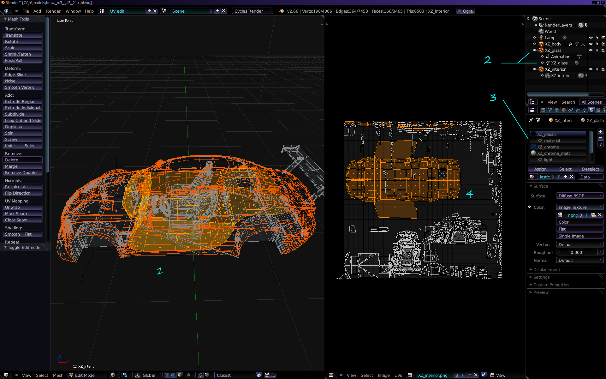
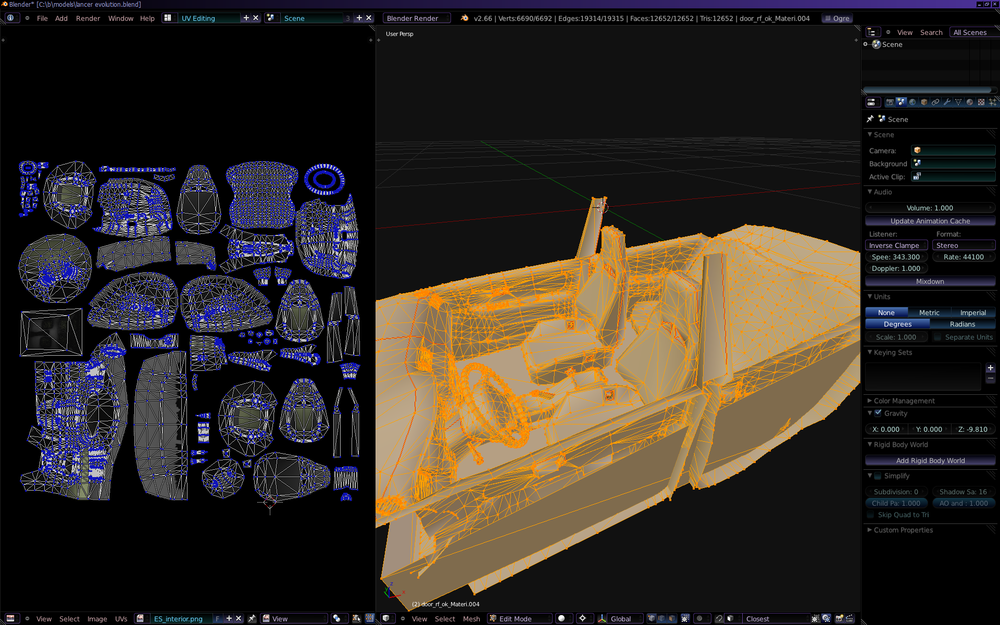
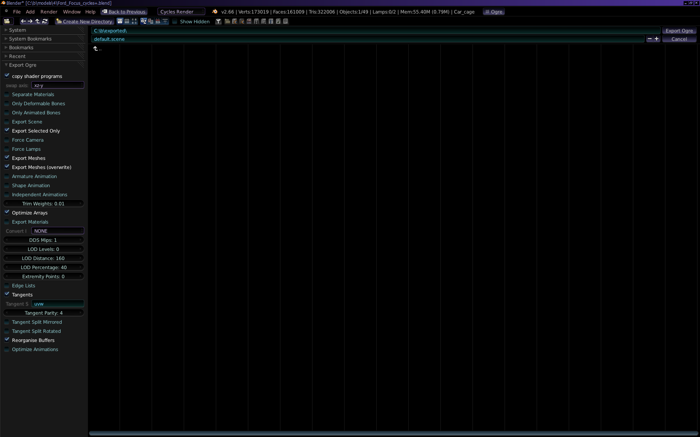
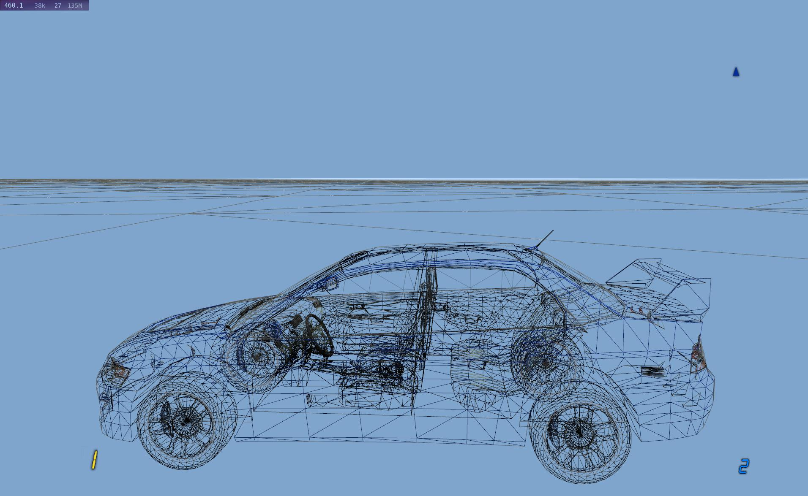
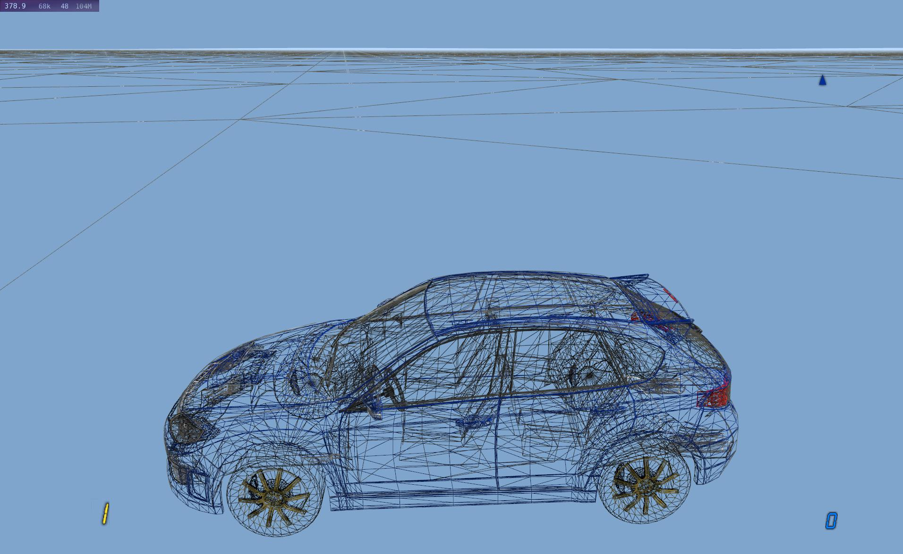
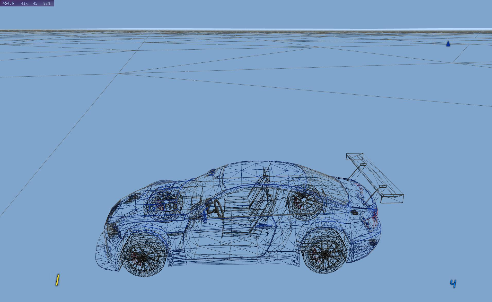

*Car modeling tips and remarks.*

### Modeling

To model a car from start requires weeks of work and good knowledge of
modeling techniques and how to do it.  
Modifying an existing car (e.g. extending its quality) is much easier.

### Model websites

There are already pretty good car models, available on
[sketchfab](https://sketchfab.com/search?category=cars-vehicles&features=downloadable&licenses=7c23a1ba438d4306920229c12afcb5f9&licenses=b9ddc40b93e34cdca1fc152f39b9f375&licenses=322a749bcfa841b29dff1e8a1bb74b0b&sort_by=-likeCount&type=models)
or [blendswap](https://www.blendswap.com/blends/category/19).  
See our forum topic, [this
post](https://forum.freegamedev.net/viewtopic.php?f=80&t=18526) shows
the list of cars.  
Some are too high poly or too low. And some just don't fit the game.  
The license for the art must be CC-BY-SA, CC-BY, CC0 or GPL so we
could use it.

Models sometimes still require some work (to have in game):

-   Lowering polygon count. No subdivisions. Decimate if necessary.
-   UV unwrap and mapping various car parts to texture parts.
-   Making interior (if not present). Texturing.
-   Baking AO maps

Models meant for rendering (not games) need these steps.  
The more of these are needed to be done, the less likely a vehicle will
be in SR.

### Blender

We are using and recommend [Blender](http://www.blender.org/) to do all
of the modeling tasks.  
At least basic knowledge of Blender is required.  
There are several good resources on internet to learn it:

-   [Blender Manual](https://docs.blender.org/manual/en/latest/).  
    Only few chapters are useful, Introduction, Modeling, and
    Texturing/Unwrapping.
-   [Blender
    Tutorials](https://www.youtube.com/watch?v=ILqOWe3zAbk&list=PLa1F2ddGya_-UvuAqHAksYnB0qL9yWDO6&index=3)
    video playlist
-   other video [tutorial
    series](https://www.youtube.com/watch?v=RqfSkU-Hp1A&list=PL3GeP3YLZn5ixsnIOIx9tB4v6s-rsw48X&index=2)
-   Basically any common task in Blender is shown on some video (e.g.
    search youtube).  
    Keep in mind the version used should be close to yours and recent.
-   There are also video tutorials specifically on car modeling.

### Blender keys

Various websites with Blender key shorcuts:
[katsbits](http://www.katsbits.com/tutorials/blender/useful-keyboard-shortcuts.php),
[keyxl](http://www.keyxl.com/aaac91e/403/Blender-keyboard-shortcuts.htm).

### Shortcuts

Some main, quite useful key shortcuts:

-   Tab - toggle edit mesh mode, Ctrl Space - zoom toggle
-   \` - quick change view, T - toolbox, N - transform, view details
-   Select: A - all, B - rectangle, C - circle, Ctrl I - Invert

<!-- -->

-   G - grab, Move, S - Scale, R - Rotate  
    \* then can press X,Y,Z for axis, and type numerical values\*
-   Ctrl A - Apply e.g. all transforms before export
-   H - Hide selected, Alt H - unhide all

<!-- -->

-   U - Unwrap, with options
-   P - Separate (e.g. faces), Ctrl J - Join meshes
-   Shift D - Duplicate\*, Ctrl M - Mirror\*

<!-- -->

-   Alt N - Normals (for e.g. Flip or Recalculate outside).
-   E - Extrude (e.g. edge or face), K - Knife tool
-   F - add face(s) (needs at least 3 vertices or 2 edges selected)
-   M - Merge vertices
-   Subdivide (faces), Bevel (edges)

Useful modifiers:

-   Decimate (reduce if too high poly)
-   Subdivision surface (if too low poly)
-   Edge split (for hard edges)
-   Mirror, Boolean, Array,Curve

  

------------------------------------------------------------------------

## Model requirements

Things to keep in mind when modeling (required by game):

### Triangles count

Keep resonable triangles count (faces, polygons).  
You can see it in top bar in Blender (turn on Statistics in viewport
Overlays).  
For a very good looking car for game, total of 50k to 150k triangles
would be required (not counting wheels, k is 1000).  
Generally the less triangles a model has, the more detail has to be on
textures.

One wheel (including brake disc and caliper) should be about 4k to 10k
triangles.  
[Comments](carmodeling.md#comments) section has more info.

More detail can (and should) be put in textures. More triangles will
unnecessary reduce game Fps.

#### Baking Maps

Ambient Occlusion (AO) is easy to bake and gives good feeling.  
Very recommended (even required) for all parts: body, interior, wheel.

Baking Normal map is usually difficult and time consuming, when
generated from high poly model.  
It is not required, but great if already present with model.  

#### How to bake AO in Blender

Split View to add new of type Shader Editor.  
Switch it to: World and  
from its menu: Add - Texture node - Image texture  
In new appeared block click button + New,  
name it e.g. AO, and set to 1024 size.  
On right in Render properties (camera icon) change engine to Cycles.  
now under Bake pane, set Bake Type to Ambient Occlusion  
set margin to 2 px (or more).  
Switch a view to UV Editor (or switch to UV Editing on top).  
From its menu Image click New, set size to 1024, name it e.g. AO2.  
Finally press Bake, back under Render properties.  
If you see any errors, make sure material has texture.  
Then rendering AO should start and appear on texture.  
After many seconds pass when it's done,  
click menu Image and Save as, to save AO texture for game.  

### Detail

Make as much detail as possible, but check out other cars.  
HI and BE models are newest and best here, have lot of detail in
textures. BE has even more, baked in normal map.  
To check geometry (triangles) just start game and press F10 to toggle
wireframe. Also game logs car meshes info in ogre.log (how to find it in
[Paths](paths.md) page).  
Look for "MESH info: " it says how many submeshes (subs, materials) and
how many triangles (tris) each part has and the total amounts.  
Most optimal and preferred is when there is 1 submesh and 1 material in
each .mesh file.

#### Normals

Keep in mind that faces in blender can be two sided, but in game are one
sided.  
Thus the face normals (in blender) must be flipped to proper side. They
won't be visible in game if on the other side.

#### Data Size

Cars (just like tracks) aren't big in size.  
ES is biggest and after export the Ogre, all .mesh files are about 1MB,
and all textures 5MB.  
It's best to keep the size not too far from that (current highest are:
6MB meshes and 19MB textures).

#### Repositories

We have git repository with .blend files for most SR vehicles  
<https://github.com/stuntrally/blendfiles/tree/master/cars>

Good example is the new HI model, was almost ready for game.  
ES had high poly model and baking normalmap (bad, not used) and ambient
occlusion was done for it.  
S8 and XZ are okay, but they had a simple unwrap and interior made.

  

------------------------------------------------------------------------

## Parts (in Blender)

Note: replace ES with the in-game car name you work with.

Name the body parts (and the geometries): ES_body, ES_interior,
ES_glass.

If you have a wheel then use: ES_wheel. ES_brake for brake disc and
caliper (not necessary).

Car gets exported to such meshes:

-   ES_body - this is car body, only 1 material, covering the metal
    parts that will be colored in game using car color. Don't include
    any geometry here that doesn't have car paint on it in Blender.
-   ES_glass - this is car glass (windows) and also can have front or
    rear lights glass (makes lights look better).
-   ES_interior - has not only interior (seats and all inside car stuff)
    but also front/rear lights, exhaust pipe, car bottom, rubber (dark)
    parts between car metail and so on. Simply all model parts that
    don't get colored by car paint.
-   ES_wheel - car wheel rim (metal) and car tire, may also have brake
    disc. It is best to use 1 material, and put parts in in different
    places (UV) of texture.
-   ES_brake - (optional)

This makes the exported files already named properly for game, so just
copying there works.

*(We use such short names, simply because it is not possible to use
original car names).*

This Blender screenshot shows (for XZ car):

1.  3D view of interior faces
2.  joined geometry parts with good names
3.  material names, still too many
4.  UV editor with unwrapped faces to texture  
    (note this is a work in progress, only interior and car bottom are
    mapped properly, rest is moslty garbage, not done yet)

A finished interior with good UV map would look similar to this (for ES
car):

Exporting models from Blender to Ogre (see
[Objects](objects#preparations) Wiki on how to install exporter) is done
from menu File\|Export\|Ogre3D.

From the exporter options pick axes as "xz-y", use tangents (mark
checked), uncheck edges-list (we don't need them).

If succesfull, you will find files in the selected folder (1 mesh file
in xml format and 1 binary mesh fie) for each selected geometry in
blender.

Copy the binary .mesh files (parts) into the data/cars/ES dir in Stunt
Rally (replacing the older/original ones).

Start Stunt Rally and check how it looks.

### Materials

Name all materials in Blender with car prefix, e.g. ES_body, ES_glass,
ES_interior, ES_wheel, etc.

Keep the material count at minimum. This is crucial.

We can't have each car part like front/rear lamps, seats, steering wheel
etc as separate parts, they must be on 1 mesh (geometry) and have UV
mapped to different parts of texture.

It is best to have each body part with 1 material, with the same name as
geometry (ES_interior, ES_glass etc).

*(Each material represents new batch (draw call) and parameter changes
which reduces game Fps).*

So, join (Ctrl-J) all geometry in interior. Mark seams on edges that
will get cut. Unwrap (U) parts.

Use UV editor to move and scale parts to according places on texture.
Don't make parts overlap on texture.

Use bigger scale for parts that require more texturing (detail).

In game we can use:

-   diffuse map - to add texture to objects, change color, etc. This is
    required, but it can be simple 1 color at start.
-   specular map - if parts have different shininess (color in rgb and
    power in alpha), e.g. this is obvious for wheel rim (shiny) and tire
    (matte), still can be on 1 texture which is more optimal (more Fps).
-   reflection map - to mark shiny parts with environment reflection
    (eg. glass, rim), or deny reflections (tire)

  

------------------------------------------------------------------------

## Data (in game)

Desired file structure in data/cars/3S (for already exported car 3S).

#### main dir, meshes

3S_body.mesh  
3S_interior.mesh  
3S_glass.mesh  
3S_wheel.mesh  
3S_brake.mesh

Those files were already described.

#### main dir, other files

about.txt - Contains info of the model, credits, changes.  
description.txt - This text file contains the info text which is
displayed in game. It has general info about the car and how it handles
in game.  
engine.wav - The engine sound file (at 7000 rpm). Must be wav and 44100
Hz, mono or stereo 16-bit.

#### in textures/ subdir

3S_body00_red.png - Main body texture. It has to be colored in saturated
red, because it will change depending on car paint chosen in game. Can
just be whole red texture at start of car creation.

3S_body00_add.png - Old version cars used this to add detail to red
texture. Can be full transparent at start.  
3S_body00_brake.png - Same as add but with rear brakes lit. The texture
add is replaced to brake when car brake is on.

3S_interior.png - interior texture (with various car parts mapped too)
possibly with 3S_interior_normal.jpg.  
3S_glass.png - the transparent glass texture (usually small)

optional: 3S_spec.png, 3S_refl.png - to map specular parts and
reflection, or deny them on matte parts.

3S_Tire.png, 3S_Tire_norm.png - diffuse and normal texture for tire
model

### Materials file

Materials for all cars are defined in data/materials/cars.mat

*(thanks to shiny material generator its syntax is simple while
materials are powerful)*

A very basic example for 3S, you can comment out lines with //.

    material car_body_3S
    {
        parent car_body
        specMap 3S_spec.png
    }

    material 3S_glass
    {
        parent car_glass2
        diffuseMap 3S_glass.png
    }
    material 3S_interior
    {
        parent car_interior
        diffuseMap 3S_interior.png
    }
    material 3S_wheel
    {
        parent car_wheel
        diffuseMap 3S_wheel.png
    }

More complicated example for ES wheel

    material ES_wheel
    {
        parent car_wheel
        diffuseMap ES_wheel.png
        normalMap ES_wheel_normal.jpg
        specMap ES_wheel_spec.png
        reflMap ES_wheel_spec.png
    }

Another for XZ wheel

    material XZ_wheel_chrome  // rim
    {
        parent car_base
        diffuseMap XZ_Tire.png
        ambient 0.1 0.1 0.1
        diffuse 0.1 0.1 0.1
        specular 1 1 1 4
        env_map true
        fresnel true
        fresnelScaleBiasPower 0.6 0.15 4
    }

  

------------------------------------------------------------------------

## Comments

No car is perfect, and every one has some smaller or bigger issues.  
I describe some here, with what could be done to improve.

We are open for artists who could improve cars (use Forum to contact us
if you want to help).  
The ALL (total) counts are computed as sum of body, interior, glass and
4 times wheel and brake.

#### ES

ES was great long ago, but recent HI or BE models have surpassed it.  
They have baked detail from high poly models into textures (and normal
maps).  
Usually models meant for PBS have even big 4k textures and more than we
need (or can have in Ogre 1.x).  
ES had okay dashboard too, so good it could actually be used for in car
camera view.

Brake.mesh tri count is too high (could use Decimate).

You can see that lines in wireframe aren't dense for body.

    ES_body.mesh     sub: 1  tri: 19.0k
    ES_interior.mesh sub: 1  tri: 38.0k
    ES_glass.mesh    sub: 1  tri:  1.0k
    ES_wheel.mesh    sub: 1  tri:  4.1k
    ES_brake.mesh    sub: 1  tri:  3.1k
    ES   ALL sub: 11  tri: 86.9k

#### S8

S8 has higher tri counts, but not much detail in textures. Hard to
improve, has to be made by an experienced artist.

    S8_body.mesh     sub: 1  tri: 43.0k
    S8_interior.mesh sub: 2  tri: 81.1k
    S8_glass.mesh    sub: 1  tri: 16.6k
    S8_wheel.mesh    sub: 1  tri:  3.9k
    S8_brake.mesh    sub: 1  tri:  3.1k
    S8_wheel.mesh    sub: 1  tri:  3.9k
    S8   ALL sub: 12  tri: 168.9k

#### XZ

This car has very smooth body, but nowadays with too low tri count.

Interior was made by me and thus is rather poor. I copied seats from S8,
and made the rest of interior by extruding 1 line and adjusting it. It
has also poor texturing there.  
But still it's an interior and better than none (the original model
didn't have it).

Next thing is that the body has holes. They are visible from close. It
is needed to add triangles to interior which would be dark and would
cover those holes. Interior also has holes, near mirrors, when seen from
inside car. Need to add more interior faces there.  
This happens because faces are 1 sided in game. When adding the second,
interior faces, keep some distance, because if it's too low, shadows are
blinking on those parts.

Wheel rim has too many tris (about 2x more). But I left it since too
much decimation can produce unwanted distortion in mesh.

    XZ_body.mesh     sub: 1  tri: 22.0k
    XZ_interior.mesh sub: 1  tri: 20.1k
    XZ_glass.mesh    sub: 1  tri:  1.0k
    XZ_wheel.mesh    sub: 1  tri: 11.8k
    XZ_brake.mesh    sub: 1  tri:  0.3k
    XZ_wheel.mesh    sub: 1  tri: 11.8k
    XZ   ALL sub: 11  tri: 91.8k

