*How to create static and dynamic objects with Blender and add to SR.*

## Procedure of adding new objects

This here is a short list of steps.

1.  Download (must be CC0, CC-BY, CC-BY-SA, or GPL)  
    or create a model in Blender
2.  Once seen the model is ok, and can be useful:
    -   create dir with a good_name - to have some consistency, when
        picking model in editor, etc.
    -   convert .tga to .png, .obj (or other) to .blend
    -   add readme.txt - a must: with original model name, author,
        license, url
    -   (old) possibly attach preview.jpg - so people may be interested
        in working with the model further
    -   upload to blendfiles repo
3.  Export from Blender to Ogre .mesh, check the look in game, remember
    scale
4.  Bullet
    -   if starting a new (dynamic) object watch this:
        [video](http://www.youtube.com/watch?v=fv-Oq5oe8Nw) and add that
        to logic,  
        then pressing P twice should start physics and export
        .bullet file
    -   for dynamic objects: add simple physics shape(s), make actor
        (rigid body)
    -   on material tab under Physics set friction
    -   on physics tab set mass, damping (linear and angular, check in
        game)
    -   don't forget to set the Margin to eg. 0.1 under collision bounds
    -   remember to reset all transforms (Ctrl A) before exports
    -   for static models: if too high poly create 1 simple mesh for it
    -   if low poly (like 0AD) do nothing, will have trimesh made in
        code
5.  Done (be happy, suggest adding it to some tracks, or make a new with
    it, use other too)

## Introduction

This section walks you through the steps to create new static objects and
to add them to Stunt Rally.

*Warning*: The learning curve for Blender is quite steep, you need to
invest a considerable amount of time to learn and use it efficiently.
Fortunately there are plenty of tutorials, websites and books to pick up
the skills.

Currently static and dynamic objects are stored in the `\data\objects`
folder in the folder you choosed to install Stunt Rally.  
It contains Ogre mesh files (binary), surface images (textures) and
bullet files for the dynamic objects.

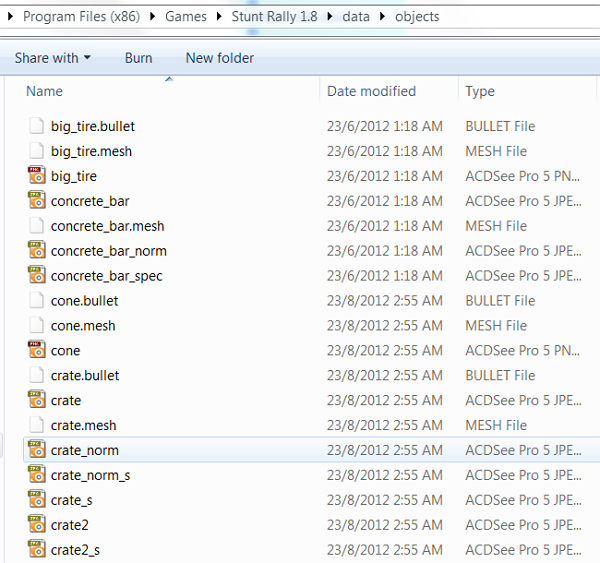

  

## Tutorial 1

### Requirements

Blender 2.6 + (current version is 2.65 as of December 2012)  
Download it from <http://www.blender.org/download/get-blender/>

### Preparations

Blender comes with plenty of import and export plugins, but the ogre
export plugin we need to download separately.  
Download the latest **blender2ogre** plugin from
<https://bitbucket.org/iboshkov/blender2ogre/downloads> (currently
version 0.6.0) and unzip the python files (io_export_ogreDotScene.py and
blender2ogre.py?).

Install the plugin in Blender  
Open preferences (menu\|file), Add-Ons, Install from file, pick
io_export_ogreDotScene.py then click Install from file.  
Next switch to tab Import-Export and find OGRE Exporter, mark that
checkbox to enable it (if it isn't).

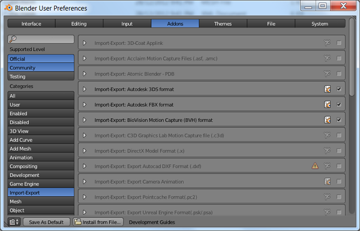

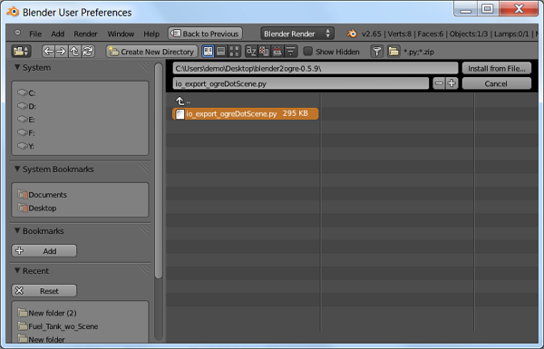

Install the Ogre Command Line tools.  
Windows: Download it from <http://www.ogre3d.org/download/tools> and
unzip it to the default folder (C:\\OgreCommandLineTools)  
Linux: Should be included with your Ogre package. On Ubuntu, it is
included in the ogre-1.9-tools package. The binary we are looking for is
"OgreXMLConverter", so try running that to see whether you have it
installed.

  

## Create a simple static object

For testing purpose we just export a Blender default object (the box, or
maybe the monkey)

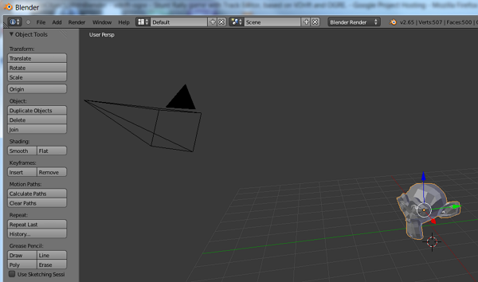

Export to mesh (File\|export\|Ogre3D)  
If succesfull, you will find 2 files in the selected folder (1 mesh file
in xml format and 1 binary mesh fie)  
From the exporter options pick axes as "xz-y", use tangents (mark
checked), uncheck edges-list (we don't need them).

**Copy the binary mesh** into the objects folder.

Start **SR Editor** and place the object.

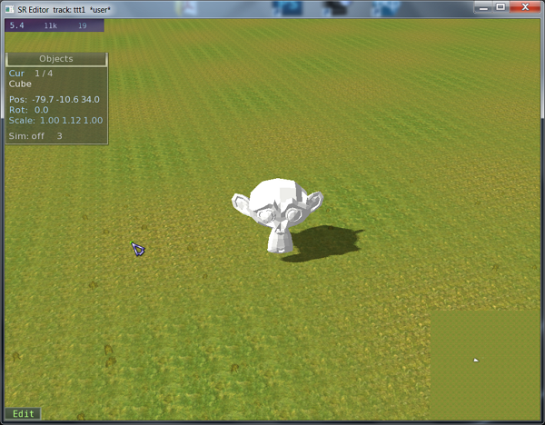

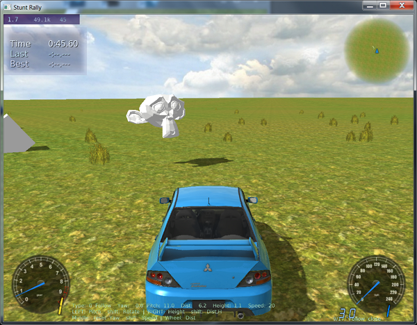

Works! Now we have Suzanne (the monkey) in our track.  
Not much interaction, other than you can collide with the object, but it
will not move. Thats why we continue to create a dynamic object, by
creating a binary bullet file containing all necessary physical
information.

  

## Create a dynamic object

Blender can export the dynamics of an object (to be more exact of the
whole world in your blender project) to binary dump. This part of the
tutorial will walk through the necessary steps.

Start Blender, we can continue with the previous test object. Change to
the Game Mode

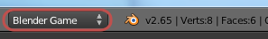

Open the Blender text editor

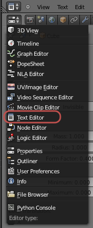

and enter this code

    import PhysicsConstraints;
    PhysicsConstraints.exportBulletFile("object.bullet")

Save it as *bulletexp*

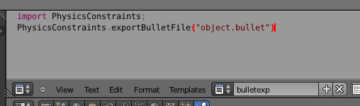

You cannot execute the script from here, we need to do this via the
running game engine.  
Open a logic editor window  
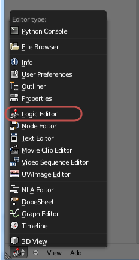

Select the cube object in the 3D view. Add a sensor for keyboard input
("p" key) and connect it to a controller to execute our script from
above

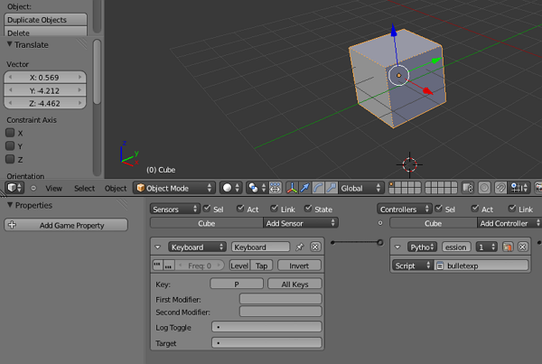

Open the physics attributes for our object and do the following
settings  
Physics Type: dynamic  
Actor  
Collision bounds box

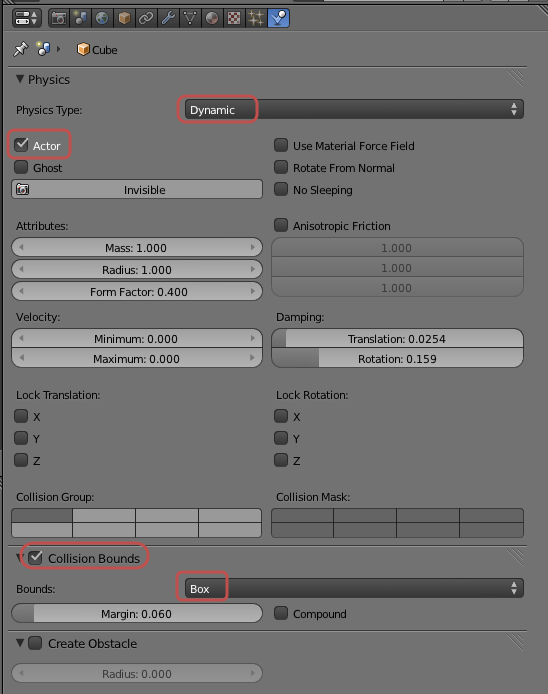

Click into the 3D window and start the engine by pressing "p"  
For a short moment you will see the object falling down.  
Press "p" again (for our keyboard sensor).

The script creates an object.bullet file in the blender folder

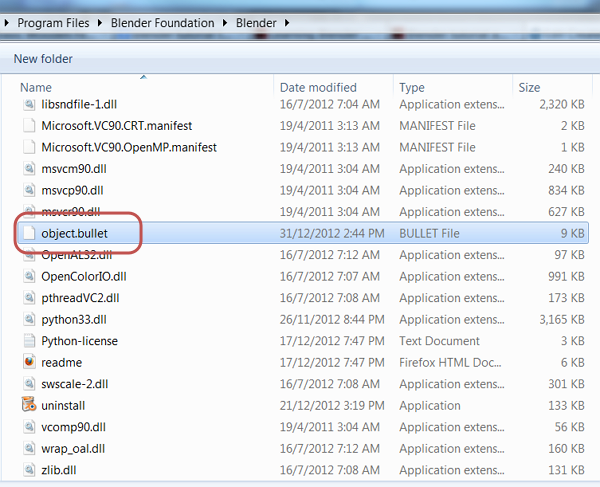

Copy the file to the same object folder as our meshfile, it must have
the same filename as the mesh file (eg. object.mesh and object.bullet)

Start the editor, place the object. Press "C" to simulate physics, if OK
check out your track.

#### Remarks on objects

Keep it low poly and use only 1 material if possible.  
I depends on how many times an object will be on track.

<table>
<thead>
<tr class="header">
<th>Example, triangle counts for various objects:</th>
<th></th>
</tr>
</thead>
<tbody>
<tr class="odd">
<td>300</td>
<td>small rock</td>
</tr>
<tr class="even">
<td>600</td>
<td>fern, plant</td>
</tr>
<tr class="odd">
<td>1k</td>
<td>small tree, rock, barrel etc</td>
</tr>
<tr class="even">
<td>3k</td>
<td>big tree (less on track)</td>
</tr>
<tr class="odd">
<td>10k</td>
<td>static object, eg. temple, that won't be many times</td>
</tr>
<tr class="even">
<td>50k</td>
<td>a detailed object, meant to be once on a track 
(eg. inside of pyramid, or spaceship, etc.)</td>
</tr>
</tbody>
</table>

Generally, using a Higher graphics preset, triangle count should be up
to 800k and batch count up to 300 (max 500), having 2 cars, vegetation,
terrain visible, in a view position that covers over half of the track.

  

## Tutorial 2

### Create new objects

Creating a new objects from the scratch with Blender requires at least
basic Blender skills.

Stick to low poly meshes and don't get templted to download an objects
with thousands of vertexes, it will pull down the framerate.

### Use objects from other websites

Download from one of the model web portals like
<http://opengameart.org/> or <http://www.blendswap.com/>

Important: Check the license under which the objects are released (at
least if you plan to submit the object to become part of Stunt Rally
distributable), preferrably CC0, CC-BY, GPL or similar.

### Materials

It is needed to name materials in blender with some prefix (e.g. from
your object) so that all material names are unique in game. Then knowing
your material names, it's needed to add them in .mat. For static objects
edit file data/materials/objects_static.mat or objects_dynamic.mat if
your object is dynamic (has .bullet file and can move).

The simplest material is white, not that diffuseMap parameter must be
present.

    material my_new_object
    {
        parent base
        diffuseMap white.png
    }

The syntax is quite simple and powerful. It allows using all implemented
material features with few lines.

    material my_new_object
    {
        parent base
        diffuseMap pers_struct.dds
        normalMap pers_struct_norm.png
        ambient 0.9 0.9 0.9
        diffuse 1.0 1.0 1.0
        specular 0.4 0.4 0.3 6
        terrain_light_map true
        bump_scale 1.3
    }

Your texture file name should be after diffuseMap. This file should also
be copied to data/objects (same place where .mesh and .bullet).

Use ambient, diffuse and specular for colors of different lighting, all
have Red,Green,Blue values. Ambient is constant (this is what you see
when objects is in shadow). Diffuse depends on light direction (only the
lit side). And specular also has a power exponent, the 4th value, after
R,G,B. Small values e.g. 4 make matte-like surfaces, where high e.g. 64
make it quite shiny.

Comments are made with //. So if you don't want to use a line you can
either delete it or add // in front.

If you have a normalMap use it in material (remember to have tangents
generated during export). Normal map could be either already provided,
or you can generate it using GIMP normal map plugin. The last parameter
bump_scale can be used to scale normal map's effect. Default value is
1.0. More will make it bumpier.

You can use own texture for specular in specMap.  
It's either RGBA and alpha is the exponent. But that is tedious to edit
everytime.  
To use only RGB add line specMap_rgb true, then specMap can also be jpg
and exponent is in alpha of specular color like usual.
