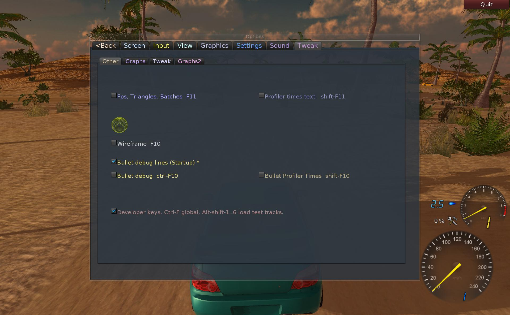
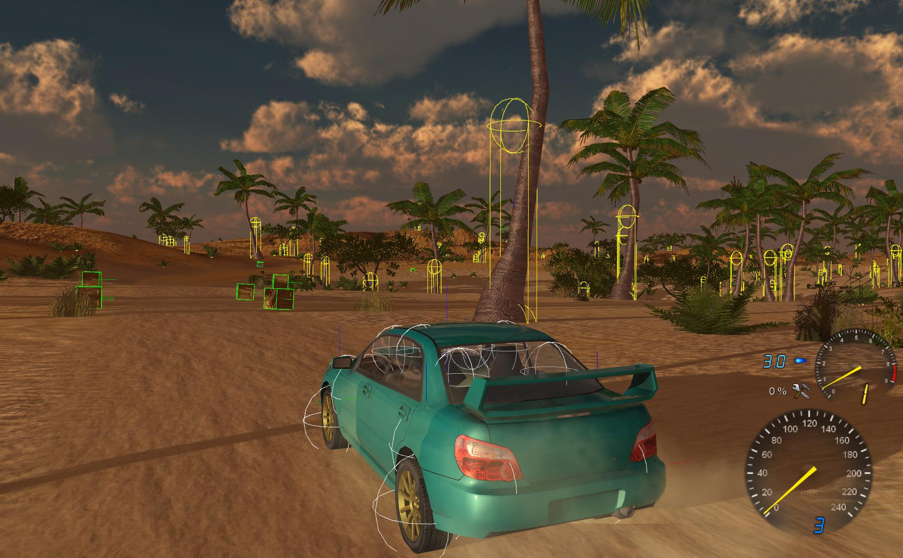
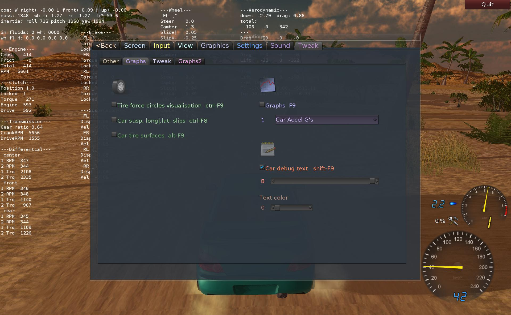
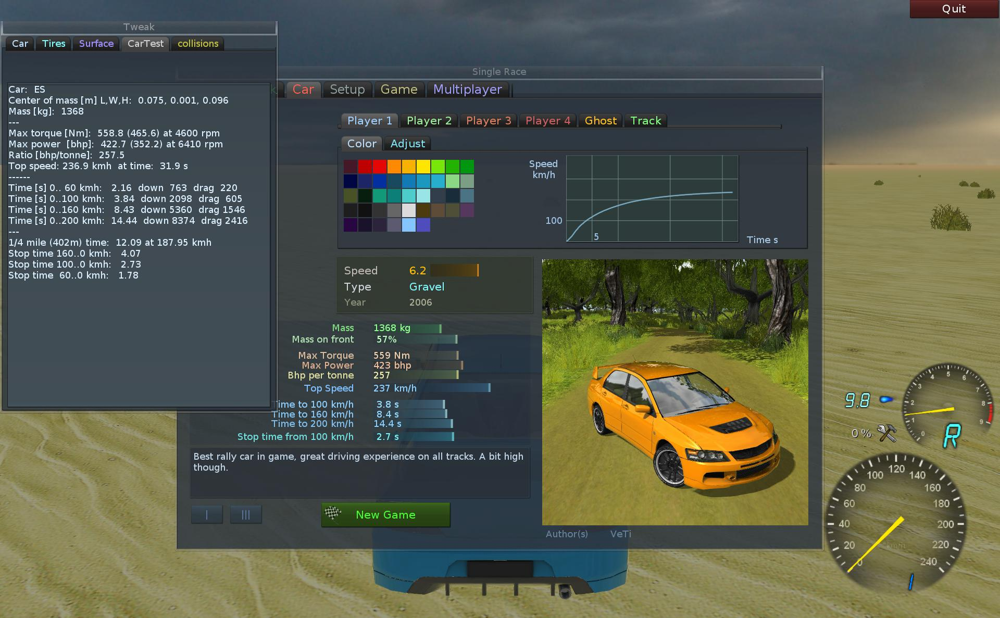
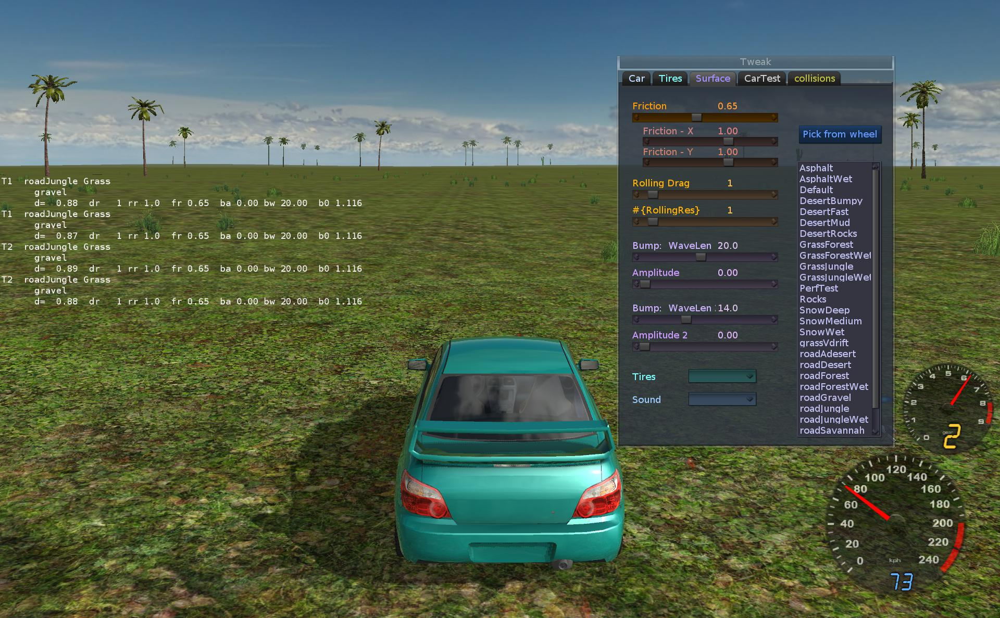
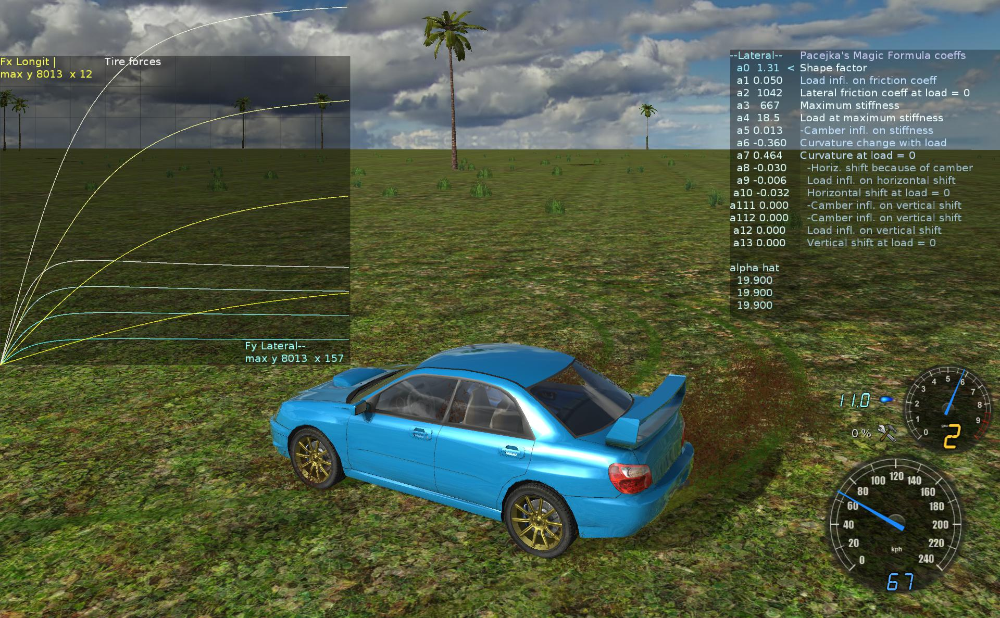
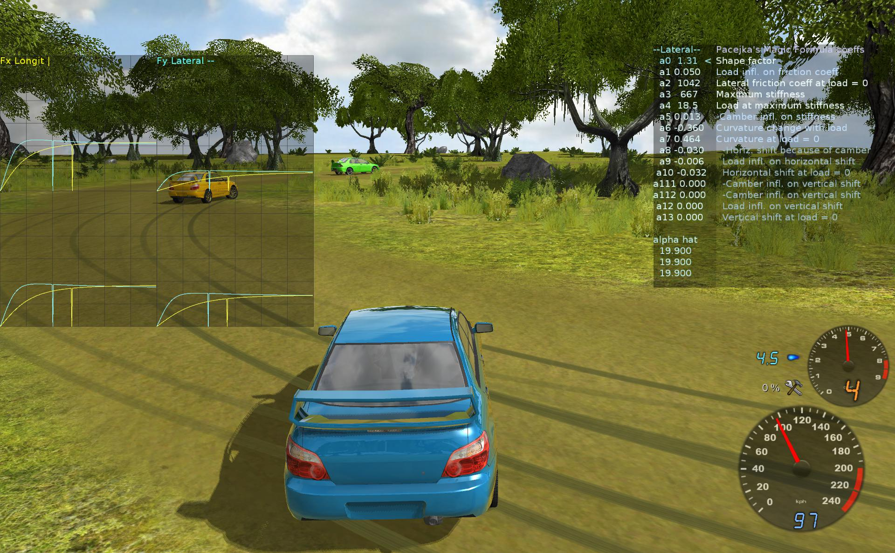

*Various tools and visualizations to tweak game.*

## Tools list

This Wiki describes most tools available in game (found on Tweak tab).  
How to use them and what are they for.  
Mainly they are helpful in visualizing the result of edited .car
sections.

They are listed here for quick guide:

| Key      | Tool name          | Description                                                                 |
|----------|--------------------|-----------------------------------------------------------------------------|
| F11      | Fps bar            | show/hide the Fps bar                                                       |
| F10      | Wireframe          | changes normal rendering to wireframe lines, Ctrl-F11 in editor             |
| Ctrl-F10 | Bullet Debug Lines | show collision shapes as lines                                              |
| F9       | Graphs             | many types, show detailed change of some values, life over time period      |
| Shift-F9 | Car debug Text     | shows text values from simulation                                           |
| Alt-Z    | Car file Editor    | allows editing .car file in game, Alt-Shift-Z will save changes and restart |
| Ctrl-F5  | Perf Test          | Starts car performance test, results show eg. 0-100 kmh time etc.           |

  

## Common

In game and editor.

### Fps bar

Toggle Fps bar showing with F11.  
This small left top bar shows 4 values (that change, especially when
moving):

1.  Rendered Frames per second (Fps), it's best to play with at least
    30, 60 being optimal for most monitors.
2.  Triangle count, e.g. 821k means there are 821 000 triangles drawn
    each frame.
3.  Batches count, e.g. 254 means there were 254 draw calls to render
    geometry on GPU.
4.  GPU Memory use. e.g. 261M means 261 MB are occupied (by textures,
    geometry etc).

Old Ogre 1.x and its rendering systems do much on CPU, and batches count
is most critical (usually bad 40 Fps starts above 400 batches or so).

### Wireframe

Toggle wireframe mode with F10. In editor use Ctrl-F11.  
It is useful to check how dense are triangles in car/wheel model (or
also for whole track).

  

## Game tools

  

### Bullet Debug Lines

This is useful to check and adjust the shape of car body that
collides.  
To use bullet lines first check the global (Startup) option, and restart
game.

  
If game was started with it enabled, you can toggle bullet debug lines
with Ctrl-F10 or the next checkbox.

If you just need to edit car collision, don't use official tracks.  
*They have a lot of vegetation and it will be horribly slow to draw all
lines (and this stays until you quit and restart game).*  
Use test tracks which are usually quite empty (and also reload fast).

  

### Developer keys

If you mark the checkbox 'Developer keys..', also shown on previous
screen (Tweak tab), you can:

1\. Use alt-shift-digit to quickly start a test track, without using
menu.  
See [here in
sources](https://github.com/stuntrally/stuntrally/blob/master/source/ogre/Gui_KeyPress.cpp#L123)
for which track is on which digit key.  
So e.g. Alt-Shift-1 will load Test1-Flat, Alt-Shift-3 loads TestC4-ow,
etc.

2\. Press Ctrl-F at any time to show Gui and focus cursor in track
search edit.

  

### Tree collisions

As shown on previous screen, you can see yellow capsule shapes for
palms.  
We use such simple shapes for trees. No need for full trimesh and should
be faster.

Editing those tree collisions, is done in game, file collisions.xml.

Open Tweak window and switch to collisions tab, to edit that file.  
Shift-Alt-Z will save your modifications, and restart game.  
See the top of this file for more info (e.g. how to disable collision or
use full trimesh for model).

  

### Car file Editor

Editing car settings (.car file) is done in game.

    Alt-Z - toggles car editor in game.
    Alt-Shift-Z - saves changes and restarts game.

Use tracks Test1-Flat or Test2-Asphalt etc, to reduce reloading time and
concentrate on editing car.

*You can use your Text Editor (e.g. to have syntax coloring) and press
F5 to reload game after saving .car file.*

If the .car file for current car wasn't modified, Editor will show cyan
"Original" text and file path.  
After saving changes, yellow "User" path will appear.

Edited .car file is located in user dir path (see [Paths](Paths)) in
data/carsim/mode/cars/ subdir,  
where mode is current simulation mode (easy or normal).

  

### Graphs

Graphs in game can be used to test more advanced car behaviour and
simulation.

Press F9 to show/hide, F2,F3 will cycle through various graph types. Or
use Gui to pick from combo.

E.g. Car engine torque curve can be seen, all gear ratios for car
speed.  
Those are explained more in [CarEditing](CarEditing).

  

### Car debug Text

This was the first simulation visualisation and it is still useful if
you want to check the values (if they don't change too fast).

Use this checkbox to toggle it or Shift-F9.

On Gui you can also change how many text sections are displayed and
change text color to black or white.

  

### Performance test

Car performance test is automatic. It's used to get car performance
info, which is shown on Gui, tab Car.

Also useful to check this when editing car (especially engine torque).

Press Ctrl-F5 to run test for current car (it will load track
`Test10-FlatPerf`).

The car will accelerate to top speed and then brake. Simulation is speed
up for this (to not wait long for results, factor in game.cfg section
sim, perf_speed, use 1 for normal).

After it finishes it will show up results, and save them in user dir.
This is in user path `/data/cars/ES/ES_stats.xml`

Perf test stats contain info like max engine torque and power, top
speed, acceleration times to 60, 100, 160, 200 km/h (with downforce and
drag at those speeds) and brake time from 100, 60 to 0 km/h.

Most of those stats are then shown in info panel on Gui when when
picking car in game.

*Run it for each sim mode (provided you made it different as game
requires). See bottom of page for differences list.*

  

## Game (advanced)

  

### Surfaces

  

### Tires

Tire editing is meant only for people with good knowledge of simulation,
who know Pacejka Magic Formula.

It can be very time consuming/wasting, and produce no better results.

Other and simpler parameters are in surfaces.cfg.
